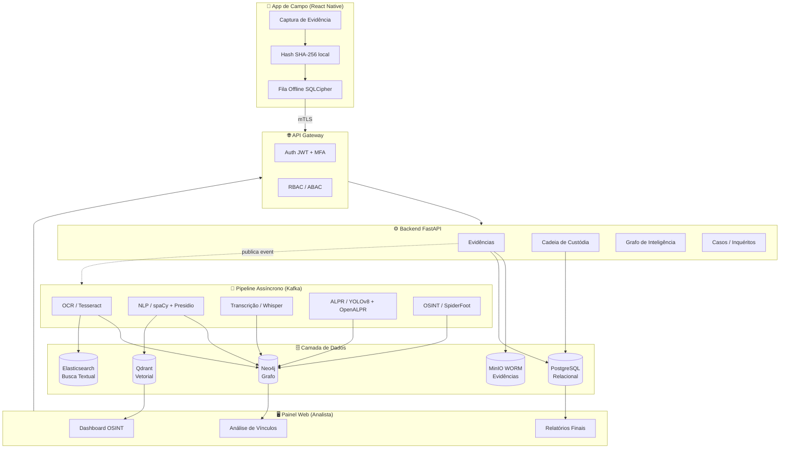
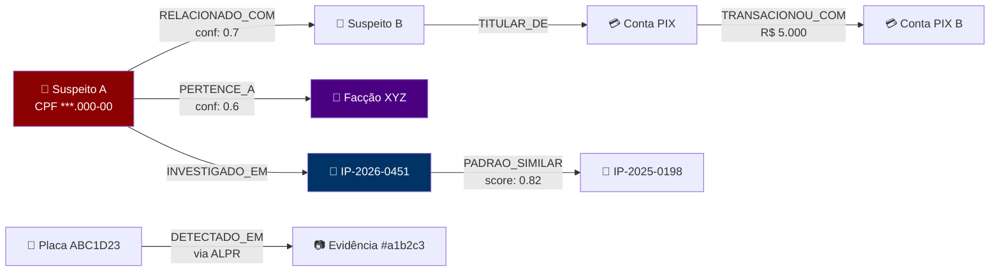
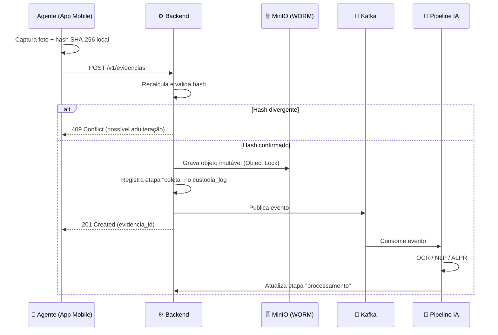

<div align="center">

# 🛡️ SIGIL
### Sistema Integrado de Inteligência e Investigação Criminal

**Plataforma de inteligência policial de última geração — App de Campo + Painel de Análise — inspirada em Palantir Gotham, IBM i2 Analyst's Notebook, Cellebrite e Europol/FBI Fusion Centers.**

[](LICENSE)
[]()
[]()
[]()
[]()
[]()
[]()
[]()
[]()

</div>

---

## 🎯 O Que é o SIGIL?

O **SIGIL** é uma arquitetura completa (backend, app mobile e painel analítico) projetada para dar à **Polícia Civil** as mesmas capacidades tecnológicas usadas por agências de inteligência internacionais — análise de vínculos em grafo, OSINT automatizado, IA generativa para investigação e visão computacional — mas construída inteiramente sobre **stack open-source**, com **cadeia de custódia digital juridicamente válida** desde a primeira linha de código.

Não é apenas um CRUD de ocorrências. É uma plataforma pensada para responder à pergunta que todo investigador faz: *"quem está conectado a quem, por quê, e eu posso provar isso em juízo?"*

---

## 🚀 Capacidades do Sistema

<table>
<tr>
<td width="50%" valign="top">

### 📱 App de Campo (Mobile)
*Offline-first — funciona sem sinal*

- 📸 Captura de foto/vídeo/áudio com **hash SHA-256 gerado no dispositivo**
- 🔄 Fila de sincronização criptografada (SQLCipher), envia sozinha quando a rede volta
- 🎤 Transcrição assistida de depoimentos em campo
- 🏷️ Vinculação de lacres físicos via QR code
- 🔐 Login biométrico + MFA, mesmo offline
- 🆘 Modo pânico — apaga dados locais sensíveis sob risco

</td>
<td width="50%" valign="top">

### 🖥️ Painel de Inteligência (Web)
*Para investigadores, delegados e peritos*

- 🕸️ **Grafo de vínculos** interativo (pessoas, contas, veículos, facções)
- 🔍 **OSINT automatizado** — perfis de risco a partir de fontes abertas
- 🧠 **IA generativa**: sumarização de depoimentos, extração de entidades (CPF, placas, PIX)
- 🎥 **ALPR + GEOINT**: leitura de placas, heatmaps de rotas de fuga, EXIF
- 🔒 **Cadeia de custódia imutável** com trilha de auditoria completa
- 📄 Geração automática de relatório final assinado digitalmente

</td>
</tr>
</table>

---

## 🧩 Arquitetura em um Diagrama



---

## 🕸️ Análise de Vínculos — O Coração do Sistema

O grafo de inteligência modela pessoas, veículos, contas financeiras, facções e inquéritos como nós conectados por relacionamentos que carregam **origem da informação** e **grau de confiança** — assim como no IBM i2 Analyst's Notebook e no Palantir Gotham.



> 💡 Essa query, por exemplo, já vem pronta no schema: encontrar **contas financeiras em comum entre suspeitos de inquéritos diferentes** — o tipo de cruzamento que quebra investigações estagnadas.

---

## 🔗 Cadeia de Custódia Digital — Válida em Juízo

Cada evidência percorre as **dez etapas obrigatórias** da Lei 13.964/19 (Pacote Anticrime, arts. 158-A a 158-F do CPP), registradas **automaticamente** pelo sistema — sem depender de preenchimento manual do agente.



A tabela `custodia_log` no PostgreSQL é **append-only por trigger** — literalmente impossível fazer `UPDATE` ou `DELETE` em um registro de custódia, mesmo com acesso de administrador ao banco.

---

## 🛠️ Stack Tecnológica

| Camada | Tecnologia | Papel no Sistema |
|---|---|---|
| **API Backend** | FastAPI (Python) | Endpoints REST, validação de hash, orquestração |
| **Mensageria** | Apache Kafka | Pipeline assíncrono de IA (OCR/NLP/ALPR) |
| **Relacional** | PostgreSQL | Casos, usuários, evidências, cadeia de custódia |
| **Grafo** | Neo4j | Vínculos, redes criminosas, organogramas de facção |
| **Vetorial** | Qdrant | Busca semântica entre inquéritos (RAG) |
| **Busca Textual** | Elasticsearch | Full-text search em autos de inquérito |
| **Objetos** | MinIO (Object Lock/WORM) | Armazenamento imutável de evidências |
| **Mobile** | React Native + SQLCipher | App de campo offline-first |
| **NLP** | spaCy + Microsoft Presidio | Extração e anonimização de entidades sensíveis |
| **Áudio** | OpenAI Whisper | Transcrição de depoimentos/escutas |
| **Visão** | YOLOv8 + OpenALPR + Tesseract | Detecção de veículos, leitura de placas, OCR |
| **OSINT** | SpiderFoot | Automação de coleta em fontes abertas |
| **Infra** | Docker + Kubernetes | Orquestração, Zero Trust, escalabilidade |

---

## 📂 Estrutura do Repositório

```
sigil/
├── backend/              # API FastAPI + workers assíncronos (Python)
│   ├── app/
│   │   ├── api/v1/           # Endpoints: evidências, custódia, grafo, casos
│   │   ├── core/              # Config, segurança, MFA, RBAC
│   │   ├── models/             # Modelos Pydantic
│   │   ├── services/
│   │   │   ├── nlp/               # Extração de entidades, sumarização
│   │   │   ├── vision/            # ALPR, EXIF
│   │   │   ├── osint/             # Integração SpiderFoot
│   │   │   └── graph/             # Camada Neo4j + cadeia de custódia
│   │   └── workers/            # Consumers Kafka
│   └── tests/
├── mobile/               # App React Native (offline-first)
│   └── src/{screens,services,storage,components}/
├── db/
│   ├── postgres/migrations/  # Schema SQL com trigger de imutabilidade
│   └── neo4j/                # Schema Cypher (constraints + seeds)
├── infra/
│   ├── docker/            # docker-compose (Postgres, Neo4j, MinIO, Qdrant, ES, Kafka)
│   └── k8s/                # Manifests Kubernetes (produção)
├── docs/                # Arquitetura, segurança/LGPD, próximos passos
└── .github/workflows/   # CI: testes automatizados + SAST (Bandit)
```

---

## ⚡ Como Rodar Localmente

```bash
# 1. Clone o repositório
git clone https://github.com/idarlandias/-SIGIL-Sistema-Integrado-de-Intelig-ncia-e-Investiga-o-Criminal.git
cd -SIGIL-Sistema-Integrado-de-Intelig-ncia-e-Investiga-o-Criminal

# 2. Configure as variáveis de ambiente
cp .env.example .env

# 3. Suba toda a infraestrutura (Postgres, Neo4j, MinIO, Qdrant, Elasticsearch, Kafka)
cd infra/docker && docker compose up -d

# 4. Instale e rode o backend
cd ../../backend
pip install -r requirements.txt
uvicorn app.main:app --reload

# 5. Crie o schema do grafo (execute no Neo4j Browser em localhost:7474)
cat ../db/neo4j/schema.cypher

# 6. Rode os testes
pytest -v

# 7. App mobile
cd ../mobile
npm install
npm run android   # ou npm run ios
```

A API estará disponível em `http://localhost:8000/docs` (Swagger UI automatico do FastAPI).

---

## ⚖️ Conformidade Legal

| Requisito | Como o SIGIL atende |
|---|---|
| **Lei 13.964/19** (Cadeia de Custódia) | 10 etapas registradas automaticamente; tabela append-only protegida por trigger de banco |
| **LGPD — Art. 23** | Base legal para tratamento por autoridades de segurança pública |
| **Minimização de dados** | Microsoft Presidio mascara CPFs/dados sensíveis fora do escopo do inquérito |
| **Auditoria completa** | Toda leitura de evidência gera log `acessado`, não apenas escritas |
| **Integridade probatória** | Hash SHA-256 calculado no dispositivo, nunca no servidor — divergência = rejeição automatica |

> 📖 Detalhamento completo em [`docs/SEGURANCA_LGPD.md`](docs/SEGURANCA_LGPD.md).

---

## 🗺️ Roadmap

- [x] Esqueleto de API com validação de hash e cadeia de custódia
- [x] Schema de grafo Neo4j com queries analíticas de referência
- [x] RBAC por papel funcional (agente, investigador, delegado, perito, admin)
- [ ] Integração real com MinIO (Object Lock)
- [ ] Pipeline de OCR/NLP/ALPR conectado a modelos reais
- [ ] App mobile com câmera, biometria e SQLCipher funcionais
- [ ] Deploy Kubernetes com Zero Trust
- [ ] RIPD (Relatório de Impacto à Proteção de Dados)

Veja o detalhamento completo em [`docs/PROXIMOS_PASSOS.md`](docs/PROXIMOS_PASSOS.md).

---

## ⚠️ Aviso Importante

Este repositório é um **esqueleto arquitetural de referência** para fins educacionais e de prototipagem em GovTech/Segurança Pública. Uso operacional por órgãos policiais exige, antes de qualquer deploy em produção: auditoria de segurança independente, validação jurídica do fluxo de cadeia de custódia por perito criminal, e aprovação formal via RIPD junto ao DPO da instituição.

---

<div align="center">

**Desenvolvido como estudo de arquitetura GovTech para Segurança Pública**

[](https://github.com/idarlandias)

</div>
