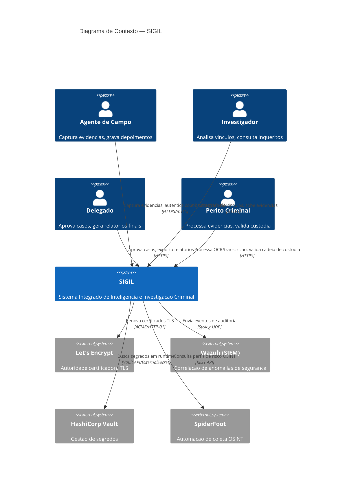
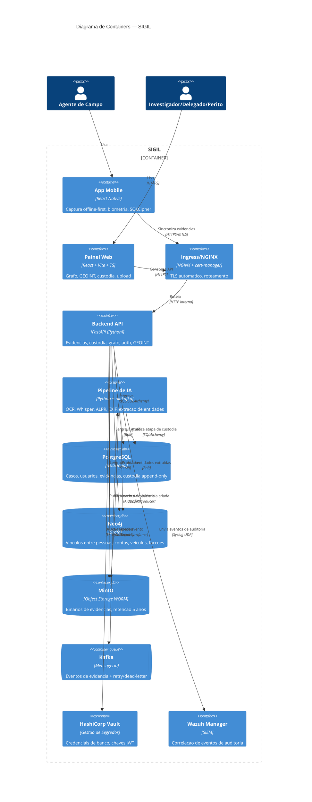
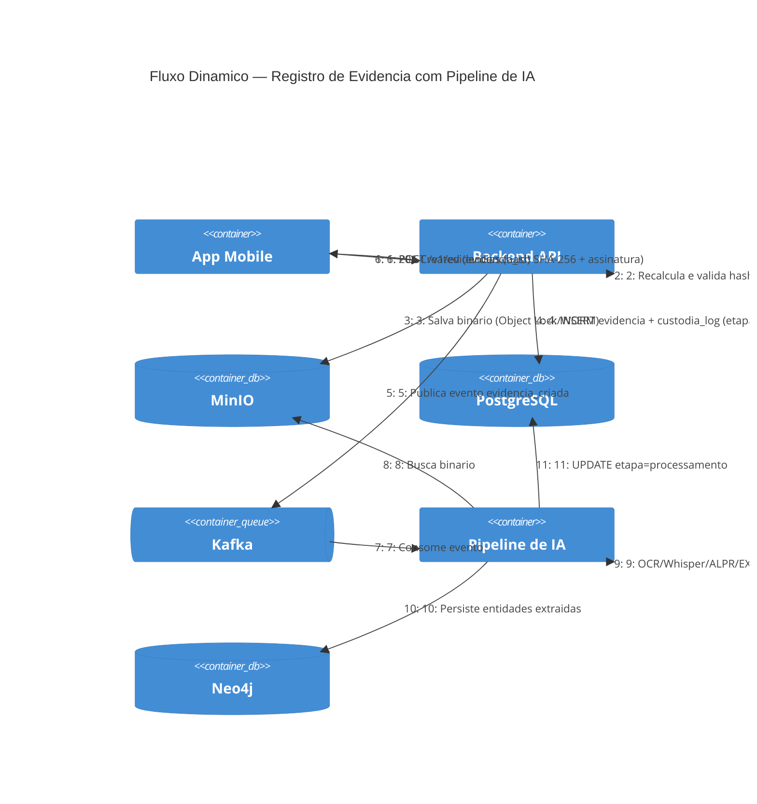

# Diagrama C4 — Arquitetura SIGIL

Diagramas em sintaxe Mermaid (compatível com PlantUML), nos quatro níveis
do modelo C4: Contexto, Containers, Componentes e um exemplo de Código.
Renderizam automaticamente no GitHub e na maioria de editores Markdown
modernos (VS Code com extensão Mermaid, Notion, etc.).

---

## Nível 1 — Diagrama de Contexto

Mostra o SIGIL como uma caixa única, seus usuários e os sistemas externos
com os quais interage.

---

## Nivel 2 — Diagrama de Containers

Decompõe o SIGIL em suas partes executáveis: apps, APIs, bancos de dados
e pipeline assíncrono.

---

## Nivel 3 — Diagrama de Componentes (Backend API)

Detalha os modulos internos do container "Backend API".

```mermaid
C4Component
    title Diagrama de Componentes — Backend API (FastAPI)

    Container_Boundary(api, "Backend API") {
        Component(auth_router, "Auth Router", "FastAPI Router", "Login+MFA, refresh token, setup MFA")
        Component(evidencias_router, "Evidencias Router", "FastAPI Router", "Registro/consulta de evidencias")
        Component(custodia_router, "Custodia Router", "FastAPI Router", "Consulta trilha de custodia")
        Component(grafo_router, "Grafo Router", "FastAPI Router", "Rede de vinculos, padroes entre inqueritos")
        Component(geoint_router, "GEOINT Router", "FastAPI Router", "Pontos geograficos para heatmap")
        Component(visao_router, "Visao Router", "FastAPI Router", "ALPR, EXIF, OCR")
        Component(transcricao_router, "Transcricao Router", "FastAPI Router", "Transcricao de audio via Whisper")

        Component(deps, "Auth/RBAC Deps", "Python", "get_current_user, exigir_permissao")
        Component(security, "Security Core", "Python", "JWT, MFA/TOTP, PERMISSOES_POR_PAPEL")

        Component(custodia_service, "Custodia Service", "Python", "registrar/obter trilha (append-only)")
        Component(neo4j_client, "Neo4j Client", "Python", "Queries de grafo por profundidade")
        Component(entidades_grafo, "Entidades->Grafo", "Python", "Persiste NER no Neo4j")
        Component(minio_client, "MinIO Client", "Python", "Object Lock/WORM")
        Component(kafka_producer, "Kafka Producer", "Python", "Publica evento + retry/DLT")
        Component(wazuh_client, "Wazuh Client", "Python", "Envia eventos ao SIEM")

        Component(extracao_entidades, "Extracao NLP", "Python", "spaCy + regex + Presidio")
        Component(transcricao_audio, "Transcricao Whisper", "Python", "Audio -> texto + segmentos")
        Component(alpr_service, "ALPR Service", "Python", "fast-alpr + fallback openalpr")
        Component(ocr_service, "OCR Service", "Python", "PaddleOCR + fallback Tesseract")
    }

    ContainerDb(postgres, "PostgreSQL")
    ContainerDb(neo4j, "Neo4j")
    ContainerDb(minio, "MinIO")
    ContainerQueue(kafka, "Kafka")
    Container(vault, "Vault")
    Container(wazuh, "Wazuh Manager")

    Rel(auth_router, security, "Usa")
    Rel(auth_router, wazuh_client, "Registra tentativas de login")
    Rel(evidencias_router, custodia_service, "Registra etapa 'coleta'")
    Rel(evidencias_router, minio_client, "Salva binario")
    Rel(evidencias_router, kafka_producer, "Publica evento")
    Rel(custodia_router, deps, "Exige 'custodia:ler'")
    Rel(custodia_router, custodia_service, "Consulta trilha")
    Rel(grafo_router, deps, "Exige 'grafo:ler'")
    Rel(grafo_router, neo4j_client, "Consulta rede")

    Rel(custodia_service, postgres, "INSERT append-only")
    Rel(custodia_service, wazuh_client, "Espelha evento")
    Rel(neo4j_client, neo4j, "Bolt")
    Rel(entidades_grafo, neo4j, "MERGE nos/relacionamentos")
    Rel(minio_client, minio, "S3 API")
    Rel(kafka_producer, kafka, "AIOKafkaProducer")
    Rel(deps, vault, "Segredos via env (ExternalSecret)")
    Rel(wazuh_client, wazuh, "Syslog UDP")

    Rel(transcricao_router, transcricao_audio, "Usa")
    Rel(visao_router, alpr_service, "Usa")
    Rel(visao_router, ocr_service, "Usa")
    Rel(extracao_entidades, entidades_grafo, "Fornece entidades")
```

---

## Diagrama Dinamico — Fluxo de Registro de Evidencia

Sequencia completa desde a captura em campo até a atualizacao da cadeia
de custodia, ilustrando a ordem real das chamadas entre componentes.

---

## Como manter este documento atualizado

Sempre que um novo modulo, endpoint ou integracao externa for adicionado
ao SIGIL, atualize o nivel de diagrama correspondente:

- **Novo endpoint de API** -> adicionar componente no Nivel 3.
- **Nova integracao externa** (ex.: novo provedor OSINT) -> Nivel 1 (Contexto).
- **Novo servico de infraestrutura** (ex.: novo banco de dados) -> Nivel 2 (Containers).
- **Alteracao no fluxo de dados critico** (ex.: cadeia de custodia) -> Diagrama Dinamico.
