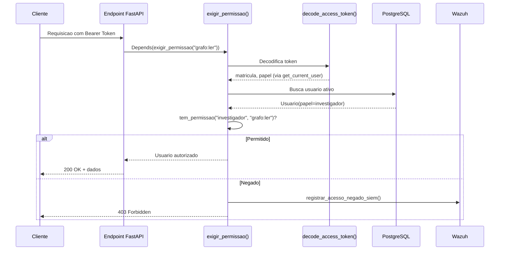

# RBAC/ABAC — Controle de Acesso do SIGIL

Documentacao detalhada do modelo de controle de acesso baseado em papeis
(RBAC), implementado em `backend/app/core/security.py` e reforcado em
cada endpoint via `backend/app/core/deps.py`. Este e o RBAC **real** —
o frontend web replica uma versao cosmetica (esconde botoes/rotas), mas
a unica fonte de verdade de autorizacao e o backend.

---

## Papeis Funcionais

O sistema define cinco papeis, cada um mapeado a um subconjunto de
permissoes granulares por recurso e acao.

| Papel | Perfil tipico | Escopo de atuacao |
|---|---|---|
| `agente` | Policial em campo, sem funcao de analise | Captura e envio de evidencias proprias |
| `investigador` | Conduz investigacoes, analisa vinculos | Leitura ampla de evidencias, grafo e casos |
| `delegado` | Autoridade responsavel pelo inquerito | Aprovacao de casos, geracao de relatorios |
| `perito` | Perito criminal, processa evidencias tecnicas | Processamento e validacao de custodia |
| `administrador` | Equipe tecnica/TI do sistema | Acesso irrestrito (wildcard `*`) |

---

## Matriz de Permissoes

Espelha exatamente `PERMISSOES_POR_PAPEL` em `backend/app/core/security.py`.

| Permissao | agente | investigador | delegado | perito | administrador |
|---|---|---|---|---|---|
| `evidencias:criar` | ✅ | ✅ | ❌ | ❌ | ✅ |
| `evidencias:ler_propria` | ✅ | ❌ | ❌ | ❌ | ✅ |
| `evidencias:ler` | ❌ | ✅ | ✅ | ✅ | ✅ |
| `evidencias:processar` | ❌ | ❌ | ❌ | ✅ | ✅ |
| `grafo:ler` | ❌ | ✅ | ✅ | ❌ | ✅ |
| `grafo:editar` | ❌ | ❌ | ✅ | ❌ | ✅ |
| `custodia:ler_propria` | ✅ | ❌ | ❌ | ❌ | ✅ |
| `custodia:ler` | ❌ | ✅ | ✅ | ✅ | ✅ |
| `custodia:registrar_etapa` | ❌ | ❌ | ❌ | ✅ | ✅ |
| `casos:ler` | ❌ | ✅ | ✅ | ❌ | ✅ |
| `casos:editar` | ❌ | ✅ | ✅ | ❌ | ✅ |
| `casos:aprovar` | ❌ | ❌ | ✅ | ❌ | ✅ |
| `relatorios:gerar` | ❌ | ❌ | ✅ | ❌ | ✅ |

> ⚠️ **Nota de implementacao atual**: os endpoints de evidencias
> (`POST /v1/evidencias`) e transcricao (`POST /v1/transcricao/audio`)
> hoje exigem apenas `evidencias:criar` — a distincao entre "ler propria"
> vs. "ler todas" para agentes ainda nao esta implementada como filtro
> de query (ver `docs/PROXIMOS_PASSOS.md`). Isso deve ser endereçado
> antes de uso em producao com multiplos agentes simultaneos.

---

## Endpoints Protegidos por Permissao

| Endpoint | Metodo | Permissao exigida | Router |
|---|---|---|---|
| `/v1/evidencias` | POST | `evidencias:criar` | `evidencias.py` |
| `/v1/evidencias/{id}` | GET | `evidencias:ler` | `evidencias.py` |
| `/v1/custodia/{id}` | GET | `custodia:ler` | `custodia.py` |
| `/v1/grafo/pessoa/{cpf}/rede` | GET | `grafo:ler` | `grafo.py` |
| `/v1/grafo/inqueritos/padroes` | GET | `grafo:ler` | `grafo.py` |
| `/v1/geoint/pontos` | GET | `evidencias:ler` | `geoint.py` |
| `/v1/visao/alpr` | POST | `evidencias:processar` | `visao.py` |
| `/v1/visao/exif` | POST | `evidencias:processar` | `visao.py` |
| `/v1/visao/ocr` | POST | `evidencias:processar` | `visao.py` |
| `/v1/transcricao/audio` | POST | `evidencias:criar` | `transcricao.py` |
| `/v1/auth/mfa/setup` | POST | Requer autenticacao (qualquer papel) | `auth.py` |

> ✅ **Corrigido nesta revisao**: `GET /v1/evidencias/{evidencia_id}` agora
> exige explicitamente `evidencias:ler` via `exigir_permissao`. Permanece
> pendente apenas o refinamento fino entre "ler propria" (agente) e "ler
> todas" (investigador/delegado/perito) — hoje um agente autenticado
> recebe 403 neste endpoint até que o filtro por `capturado_por` seja
> implementado como alternativa via `evidencias:ler_propria`.

---

## Fluxo de Verificacao (RBAC real)



---

## RBAC Visual no Frontend (cosmetico, nao autoritativo)

O painel web (`web/src/store/authStore.ts`) replica esta mesma matriz em
TypeScript, usada apenas para esconder botoes e rotas que o usuario nao
teria permissao de usar — **nunca** para decidir se uma acao e permitida.
Todo acesso real e sempre validado pelo backend, mesmo que o frontend
tenha uma falha e exiba um botao indevidamente.

```typescript
// web/src/store/authStore.ts (trecho)
const PERMISSOES_POR_PAPEL: Record<string, string[]> = {
  agente: ['evidencias:criar', 'evidencias:ler_propria', 'custodia:ler_propria'],
  investigador: ['evidencias:criar', 'evidencias:ler', 'grafo:ler', 'custodia:ler', 'casos:ler', 'casos:editar'],
  delegado: [/* ... */],
  perito: [/* ... */],
  administrador: ['*'],
};
```

---

## Recomendacoes de Evolucao (ABAC)

O sistema atual e puramente RBAC (papel -> permissoes fixas). Para
cenarios mais refinados, considerar migracao parcial para ABAC
(Attribute-Based Access Control), por exemplo:

- **Escopo por delegacia**: investigador so acessa casos da propria delegacia.
- **Escopo temporal**: acesso a evidencias revogado automaticamente apos
  arquivamento do inquerito (integra com o item de retencao do RIPD, risco R-05).
- **Escopo por sigilo**: inqueritos com decretacao de segredo de justica
  exigem permissao adicional explicita, nao apenas o papel funcional.

Essas extensoes devem ser avaliadas junto ao Encarregado de Dados e a
Corregedoria antes de implementacao, dado o impacto direto na cadeia de
responsabilizacao (accountability) exigida pela LGPD.
